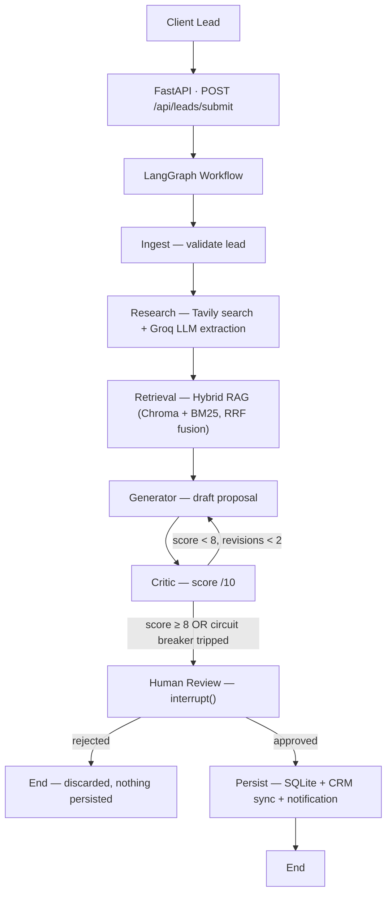

# ⚡ ProposalFlow AI

**An agentic AI system that automates the freelance lead-to-proposal workflow** — research, retrieval, drafting, self-critique, and human sign-off, all orchestrated as a resumable LangGraph pipeline.


---

## Overview

Freelancers lose hours on every lead — researching the client, digging up a relevant past project, and writing a proposal that doesn't sound copy-pasted.

**ProposalFlow AI** automates that entire loop while keeping a human as the final decision-maker. Given a raw lead (client name, project description, optional website/budget/deadline), the system:

1. **Ingests** and validates the lead
2. **Researches** the client/company with live web search
3. **Retrieves** relevant past projects from a portfolio knowledge base using hybrid (vector + keyword) search
4. **Drafts** a tailored proposal with an LLM
5. **Critiques** its own draft against the brief and flags gaps or hallucinations
6. **Regenerates** automatically if the draft falls short (bounded by a circuit breaker)
7. **Pauses** and waits for a human to approve or reject it
8. **Persists** the approved proposal and syncs it out to a CRM/notification channel

Nothing is saved or sent anywhere until a human explicitly approves it.

---

## Architecture



The whole workflow is a single `StateGraph` compiled with a SQLite checkpointer, so any run can pause at the human-review step and resume later — even after a server restart — by replaying from its `thread_id`.

---

## Key Features

- **Agentic pipeline** built on LangGraph, with typed state (`ProposalState`) threaded through every node
- **Live company research** via the Tavily search API, summarized into structured business intelligence by an LLM
- **Hybrid RAG** over a markdown knowledge base of past projects and pricing guidelines — Chroma vector search and BM25 keyword search, fused with Reciprocal Rank Fusion (RRF)
- **Self-critique loop** — a critic node scores each draft out of 10 and lists missing requirements or unsupported claims; the generator revises automatically, capped by a circuit breaker so it can't loop forever
- **Human-in-the-loop gate** — `interrupt()`/`Command(resume=...)` pauses the graph until a person approves or rejects, before anything touches the database
- **Durable, resumable runs** — LangGraph state is checkpointed to SQLite (WAL mode) per `thread_id`
- **Idempotent persistence** — approved leads/proposals are upserted into a relational store (clients → leads → proposals)
- **Non-blocking outbound integrations** — Slack-compatible webhook alerts and a generic CRM sync, both fail silently if unconfigured
- **FastAPI backend** with a small, explicit REST surface, plus a **Streamlit review console** for submitting leads and approving/rejecting drafts from a UI
- **Optional LangSmith tracing** for observability into every LLM call and graph step

---

## Tech Stack

| Layer | Technology |
|---|---|
| Orchestration | LangGraph (`StateGraph`, conditional routing, `interrupt`/resume, SQLite checkpointer) |
| LLM | Groq (default model `openai/gpt-oss-120b`) via `langchain-groq` |
| Web research | Tavily Search API |
| Retrieval / RAG | ChromaDB (vector store) + `rank_bm25` (lexical) fused via Reciprocal Rank Fusion; `sentence-transformers/all-MiniLM-L6-v2` embeddings |
| Backend API | FastAPI + Pydantic v2 |
| Frontend | Streamlit review console |
| Persistence | SQLAlchemy ORM over SQLite (`clients`, `leads`, `proposals` tables) |
| Integrations | Generic CRM webhook sync, Slack-compatible notification webhooks |
| Observability | LangSmith tracing (optional) |
| Testing | Pytest, FastAPI `TestClient` |

---

## Project Structure

```
proposalflow-ai/
├── data/
│   └── knowledge_base/        # Markdown case studies + pricing guidelines (the RAG corpus)
├── frontend/
│   └── app.py                 # Streamlit review console (lead intake + approve/reject UI)
├── src/proposal_bot/
│   ├── api/                   # FastAPI app, routes, request/response schemas
│   ├── db/                    # SQLAlchemy models (Client, Lead, Proposal) + session
│   ├── integrations/          # CRM sync + webhook notifications (non-blocking)
│   ├── nodes/                 # LangGraph nodes: ingestion, research, retrieval, generator, critic, persist
│   ├── rag/                   # HybridRetriever (Chroma + BM25 + RRF)
│   ├── config.py              # Pydantic settings, loaded from .env
│   ├── graph.py               # Workflow definition, routing logic, human-review node
│   ├── main.py                # CLI entry point — runs one lead through the full pipeline
│   ├── prompts.py             # LLM prompt templates
│   └── state.py               # Pydantic/TypedDict schemas + the graph's shared state
├── tests/                     # Pytest suite (API, graph flow, node schemas, retrieval, integrations)
├── .env.example
├── requirements.in / requirements.txt
└── uv.lock
```

---

## Getting Started

### Prerequisites

- Python 3.11+
- A **Groq API key** — required; powers research extraction, proposal drafting, and the critic
- A **Tavily API key** — required; powers live company research
- Optional: a LangSmith API key (tracing), a Slack-compatible webhook URL (notifications), and a CRM endpoint (lead sync)

### Installation

```bash
git clone https://github.com/Rounaksenskr/proposalflow-ai.git
cd proposalflow-ai
python -m venv .venv
source .venv/bin/activate      # Windows: .venv\Scripts\activate
pip install -r requirements.txt
```

### Configure environment variables

```bash
cp .env.example .env
```

| Variable | Required | Purpose |
|---|---|---|
| `GROQ_API_KEY` | **Yes** | LLM calls for research extraction, proposal generation, and critique |
| `GROQ_MODEL` | No (default `openai/gpt-oss-120b`) | Which Groq-hosted model to use |
| `TAVILY_API_KEY` | **Yes** | Live web research on the client/company |
| `LANGSMITH_API_KEY`, `LANGSMITH_TRACING`, `LANGSMITH_PROJECT` | No | Optional LangChain/LangGraph tracing |
| `CRM_API_URL`, `CRM_API_KEY` | No | POSTs approved proposals to a CRM endpoint; sync is skipped silently if unset |
| `NOTIFICATIONS_WEBHOOK_URL` or `SLACK_WEBHOOK_URL` | No | Sends a Slack-style alert when a proposal needs review or finalizes |

Local data is stored entirely in SQLite and created automatically on first run — no external database server needed:
- `proposal_db/records.db` — client, lead, and proposal records
- `proposal_db/checkpoints.sqlite` — LangGraph run state (enables pause/resume)
- `proposal_db/chroma` — the vector index over `data/knowledge_base`

### Run the API

```bash
export PYTHONPATH=src          # Windows (PowerShell): $env:PYTHONPATH="src"
uvicorn proposal_bot.api.app:app --reload --port 8000
```

Interactive API docs: `http://127.0.0.1:8000/docs` · Health check: `http://127.0.0.1:8000/health`

### Run the review console

With the API running, in a second terminal:

```bash
streamlit run frontend/app.py
```

Use the sidebar to submit a lead, then paste the returned `thread_id` into the main panel to inspect the draft and approve or reject it.

### Or run one lead end-to-end from the CLI

```bash
export PYTHONPATH=src
python -m proposal_bot.main
```

Runs a sample lead through the full pipeline and prompts you in the terminal to approve or reject before it persists.

---

## API Reference

| Method | Endpoint | Description |
|---|---|---|
| `POST` | `/api/leads/submit` | Submit a new lead; runs the pipeline until it pauses for human review |
| `GET` | `/api/proposals/{thread_id}` | Fetch the current draft, critic history, and status for a run |
| `POST` | `/api/proposals/{thread_id}/review` | Submit an approve/reject decision; resumes the graph and persists on approval |
| `GET` | `/health` | Service health check |

---

## How the Pipeline Works

Each lead runs as its own `thread_id` through a compiled LangGraph workflow:

1. **Ingest** — validates the raw payload against a strict schema.
2. **Research** — builds a targeted Tavily query from the client's name/website, then has the LLM extract a structured `ResearchArtifact` (industry, pain points, tech signals, sources). Falls back gracefully if the search or extraction fails.
3. **Retrieval** — `HybridRetriever` runs vector search (Chroma) and keyword search (BM25) over `data/knowledge_base`, fuses the two rankings with Reciprocal Rank Fusion, and returns the most relevant past projects.
4. **Generator** — drafts a full proposal (executive summary, scope, tech stack, timeline, pricing, relevant experience) grounded in the research and retrieved cases.
5. **Critic** — scores the draft out of 10 and lists missing requirements or unsupported claims. If it scores below 8 and fewer than 2 revisions have happened, it's sent back to the generator; otherwise (pass, or the circuit breaker trips at 2 revisions) it moves on.
6. **Human Review** — a webhook alert goes out, then the graph pauses with `interrupt()`. It stays paused — durably, via the SQLite checkpointer — until `POST /api/proposals/{thread_id}/review` resumes it with a decision.
7. **Persist** — on approval, the client/lead/proposal are idempotently upserted into the database, then synced to the CRM and a final-status notification is sent. On rejection, the graph ends and nothing is written.

---

## Testing

```bash
pytest
```

`pyproject.toml` already points pytest at `src/` and `tests/`, so no extra setup is needed. The suite covers the health endpoint, graph routing logic, `ProposalDraft`/`CriticFeedback` schema validation, the hybrid retriever, and the notification/CRM integrations' non-blocking bypass behavior.

---

## Extending the Knowledge Base

Add more past-project write-ups to `data/knowledge_base/*.md` with YAML frontmatter, e.g.:

```markdown
---
id: "proj-05-healthtech"
title: "Patient Intake Portal for a Telehealth Startup"
industry: "Healthcare"
technologies: ["React", "FastAPI", "PostgreSQL"]
budget: "$6,000"
delivery_weeks: 4
---

Body describing the project, approach, and outcome...
```

New files are picked up automatically the next time the retriever indexes the corpus.

---

## Author

Built by **Rounak** ([@Rounaksenskr](https://github.com/Rounaksenskr)).
